# Pratical Class Notes


### Docker commando to create network

```

docker network create cbd-network

```


### To start a cassandra server isntance
```

docker run --name cassandra-cbd --network cbd-network -d cassandra:latest

```

### Connecto to Cassandra from cqlsh

```

docker run -it --network cbd-network --rm cassandra cqlsh cassandra-cbd

```


# Cassandra and the Relational Model


All the required information for a query is confined in a single table


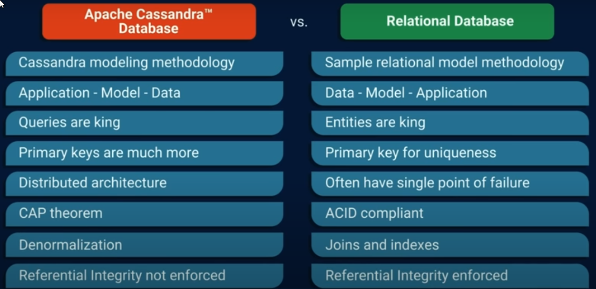


### Cassandra Operates under the AP Model


#


## DataModel
Abstract model for organizing elements of the data, data models vary on the type of capability and porpuse os the DB. For Cassandra the data model is built arround Queries


## KeySpace
Outmost Logical Container of tables. It's a container for replication. It stores tables and replication data

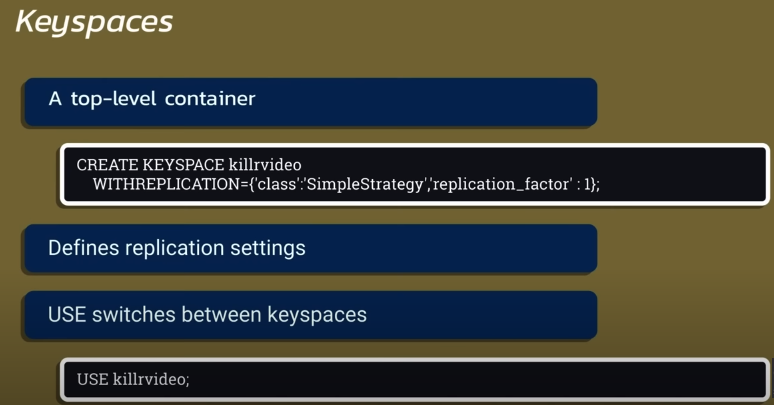

## Table 
Combination of Rows and Collumns

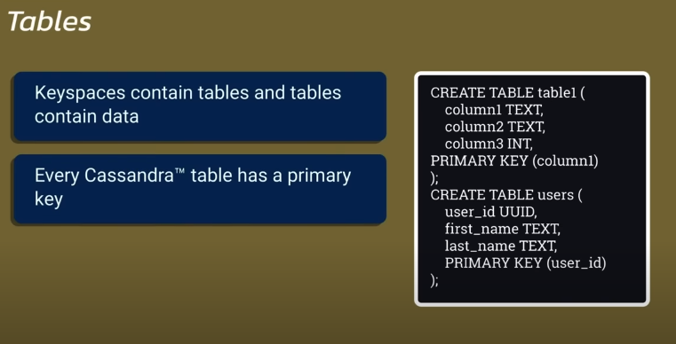


## Primary Key
First it guarantees the uniqueness of the data. It defines the placement of the record in the cluster. This allows for easy access of the data in the Model.

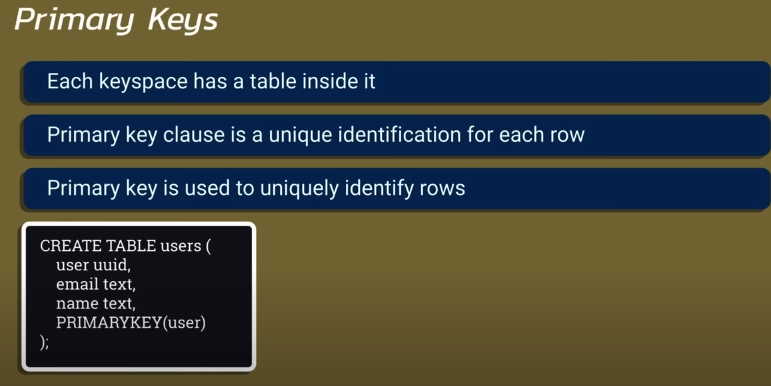


## Partition Key
First Part of the primary key. It determines where in the cluster the data will be stored, and on wich node it will be stored 


#


## Partitioning Concepts

Partitions give you and indication where data is in the Data Model and the cluster


These queries fail because the partitioning key is absent from the queries, and Join Operations are not suported in Cassandra


### Join Commands in SQL

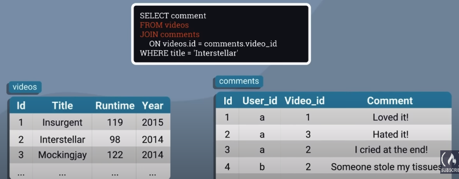


### Denormilized table in Cassandra

To achieve the same result as in the SQL Database we need to denormilise our tables

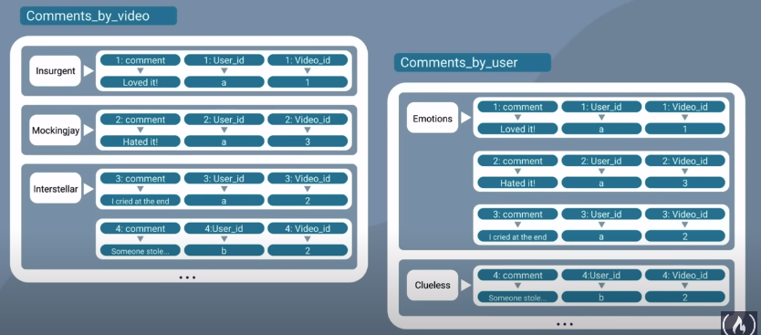


# Data Types for flexibility

### Collections Counters and User Defined Types

## Collections
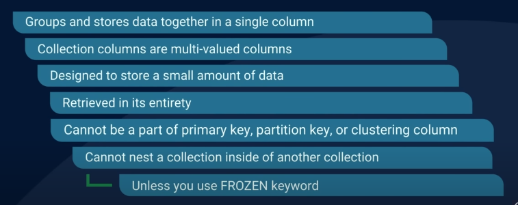

* **Set** 

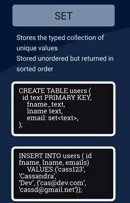


* **List**

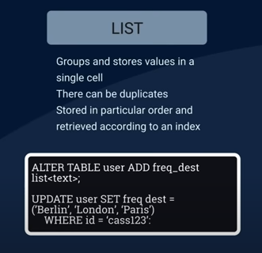

* **Map**

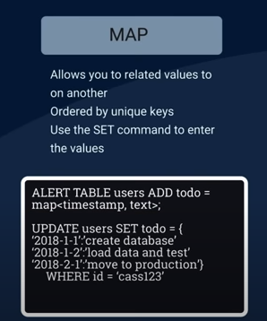

<br>

## UDT - User Defined Types


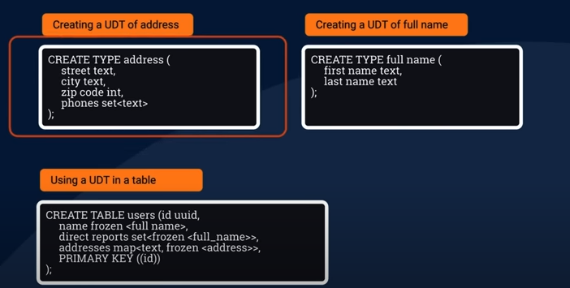

## Counter

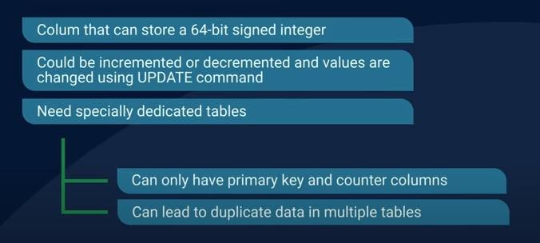
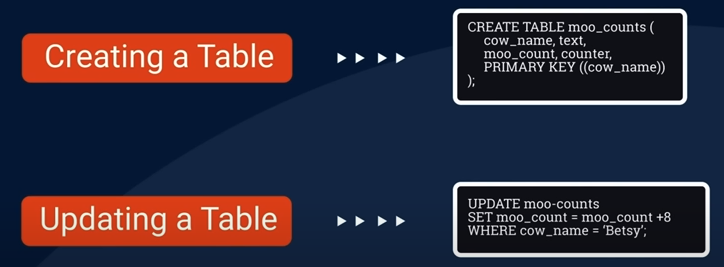

