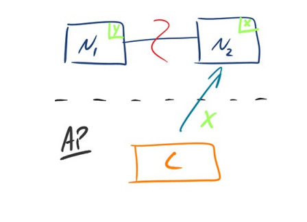
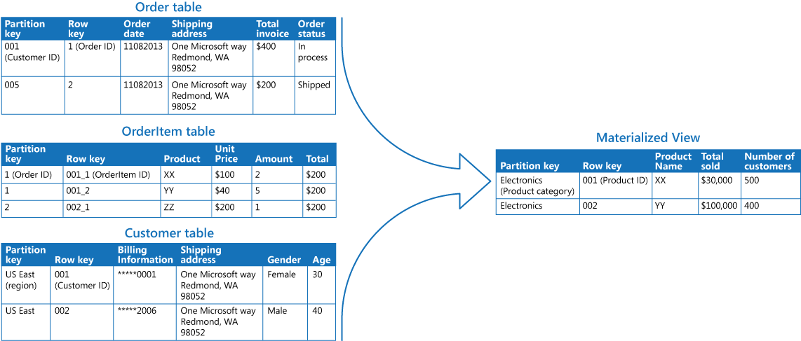

# CBD
Repositório referente à disciplina de Complementos de Base de Dados 2022/23
repository referent to the Class Advanced DataBases 2022/23

# Pratical Assignments

* Redis
* MongoDB
* Cassandra

# Theoretical Classes

Many Applications nowadays are more **data-intensive** than **compute-intensive**. This means that, for a lot of applications, CPU Power is not a lmiting factor. A lot of problems consist of:
* The ammount of data
* Complexity of data
* Speed of data changes

### Common operations in Data Systems
* (***DataBases***) Store data so that it can be found later
* (***Caching***) Remember the result of an expensive operation
* (***Search Index***) Allow users to search data by keywords or filters
* (***Message Queues***) Send message to another proccess to be handled asynchronously
* (***Stream Processing***) Observer what is happening and act on events as they occur
* (***Batch Processing***) Periodically crunch a large ammount of accumulated data

## Data Systems

More and more, applications have wide-ranging requirements. Many times these requirements are broken down into diferent tasks using different tools. They may need **caching**, a **text Search Server**(Solr), **main database**(MySQL), etc.

**Example of an architecture for a data System involving serveral components**
</img>
<sub>(image from Designing Data-Intensive Applications by Martin Kleppmann)<sub>

## Data Systems Challenges and Requirements

### Challenges
* How to ensure data remains correct and complete
* Provide constantly good performance
* How do you scale and handle bigger loads
* What is a good Api for a service

### Requirements
- **Reliability** -> should continue performing the correct function at the desired performance (even if there are issues)
- **Scalability** -> As the system grows, there should be ways to handle that growth
- **Maintainability** -> Many people, overtime, should be able to work with the System. (Maintaining the current behaviour and adopting the systems to new use cases)


---------------------------------------------


# Database Systems (brief introduction)
A **Database** is normally refered as a set of related data and it's organization

**DBMS(DataBase Managment System)** controls access to this data. Allows:
* writting 
* searching
* updating 
* retrieving 
* removing

From the **1980s until now today**, Relational Databases have been domination the market. They achived this because they are:
* Fast
* A normalized DB has no redundant data
* Developers are very familiar with Relational DBs
* The querie language for SQL is very well known and very good

In the **2000's** we have alse seen the start and growth of **OLAP(OnLine Analytical Processing)** and with this other models have been created

## Database Models

Database Models play a very important role in the development of software. They change:
* how software is written 
* how we think about the problems we are solving

A **Database Model** shows the logical structure of a database, including relanstioships and constrains that determine how data can be stored and accesses.

**Types of Database Models**:
* Hierarchical database model
* Relational model
* Network model
* Object-oriented database model
* Entity-relationship model
* Document model
* Entity-attribute-value model
* Star schema

-------------------

## ACID Properties in DBMS

A **Transaction** are single logical unit of work that access and possibly modifies contents in a Database.
Transactions access data using **read/write** operations. To maintain consistency in a Database we must follow certain properties. They are called **ACID**. 

### ACID
* **A** -> **Attomic** All changes to data are performed as if they are a single/atomic operation. This also means that if a transaction takes more than one operation to be completed, then all operations complete and commit or none do.  
* **C** -> **Consistency** A transaction transforms the database from one consistent state to anothe consistent state. Data is consistent when a transaction starts and when it ends
* **I** -> **Isolation** The intermideate state of transactions is invisible to other transactions. The results of a transaction are not visible until the transaction is completed
* **D** -> **Durable** The result of a failure transaction suvive failures. After a transaction is completed, even in the event of a crash or failure, transactions and changes won't be undone


----------------

## The Relational Model

Proposed in 1970, it has **dominated the market for more than 30 years**. It offers:

* **Persistance** -> We can store date and it will remain stored
* **Integration** -> Can be integrated into many different Apps
* **Standart** -> SQL, very well understood, very expressive, very good
* **Transactions** -> **ACID** properties


### Current Trends and the Problems and Issues of the Relational Model

* Increasing Volume of data and traffic
* More complex data connectedness
* The impedence mismatch problem

## Object-Relational Impedance Mismatch
Set of conceptual and technical difficulties that are often encoutered when a relational DBMS is being served by a Object-Oriented Program.

* The object oriented program uses object connections and orientation based on **Software engineering principles**
* Relational Paradigms are based on **Mathematics and Set Theory**

Mapping one to the other carries problems. Example of impendance Mismatch:


These problems are caused by normalization, but why do Relational DBs normalize?
* Constency both in style and spelling
* Avoiding ambiguity
* Easier to update (for example a team name)
* Avoids repeating data

The problems of impedance mismatch are not only that they add complexity to build software, they also make something more time consuming. We end up creating a representation of an object but when we want to store it we need to break it down into it's components and it needs to be encoded again. The problem also occurs when we want to the opposite operation.  

## Increased Data Volume

We are storing, creating and processing more data then ever before.
To deal with this increased storage needs we need to scale. Scalling can be done in two ways:
* horizontally -> more machines
* vertically -> bigger machines

SQL and DBMS suffer from the problem that it is almost impossible to scale horizontally. Most are designed to work on Single Large Machines

## Increased Data Connectivity

The data we are producing and exchanging is evolving and changing but not our DBMS

-----------------------

# The NOSQL Movement

The term NoSQL has changed over time from "no" to "not only". It does not refer to any technology in particular. It is usually used to refer to a group of different mostly non-relational technologies.

Key attributes of NoSQL:
* **Non Relational**
* **Simple API**: no Join
* **BASE and CAP**: no ACID requirements
* **Schema Free**: implicit schema on application side
* **Inherently Distributed**: some more than others
* **Open Source**: most of them at least


# BASE Transactions
* **BA** -> **Basic Availability** The database appears to work most of the time
* **S** -> **Soft State** Store don't have to be write-consistent nor do replicas have to be mutually consistent all the time. The BASE Model **does not enforce consistency**
* **E** -> **Eventual Consistency** The data model although does not enforce consistency it does not mean it won't be achieved. Until it does reach consistency reads are still possible. Stores wil exhibit consistency at some later point.

Characteristics:
* Optimistic
* Simpler and Faster
* Availability First
* Best Effort
* Approximation is OK

# CAP (Brewers's CAP theorem)

By Brewers's CAP theorem a distributed system can only support **2 of the following characteristics**

* **Cosistent** -> Writes are atomic, this means all subsquent requests receive the same value
* **Available** -> The database will always return a value so long as the server is running
* **Partition Tolerable** -> The system still fucntions even thought the cluster network is partitioned. This means, System will not fail even if there is a break between nodes


Assuming that we have a Distributed System it will most likely be **Partition Tolerable**. Therefore we have two options we can choose: **AP (Available and Partition Tolerable)** or **CP (Consistent and Partition Tolerable)**

|AP|CP|
|--|--|
|||
|Since Node1 and Node2 lost connections the system will return N2's most recent value and always be **available**. This value may be correct or wrong|Since Node1 and Node2 lost connections the system cannot ensure that it will return a consistent value, so it return an Error instead|

### Data Models in relation to CAP


# Types of NoSQL databases

* **Core Types**
    * Key-Value Stores
    * Document Stores
    * Column Stores
    * Graph Databases
* Non-Core Types
    * Object Databases
    * Native XML databases
    * RDF stores

### Data Connectivity of each DB Model


--------------------------------

# Storage and Retrieval

On the most fundamental level a database needs to do two things. **Store Data** and when you ask for data back, retrive it to you. All DBs do this but some are better at certain operations. Understanding these differences and Data Structures is important for selecting the best DB for your System.

The CSV is a good demonstration of their importance
- In a CSV the write/set function just appends to a file. This has very good performance, O(1) (many databases also use append-only data files for inserts)
- The read/get function however will take O(n) and this is not so ideal in a database with lots of records
(we can use an index to make reads faster but this will slow down the writes)

## Hash Indexes

Key-value stores are quite similar to the dictionary type that you can find in most
programming languages, and which is usually implemented as a hash map (hash
table). A simple key value Store were we append a file as the CSV example with a Key and a Value. This will have a O(n) lookup operation. Hash Indexes can greatly increase this time

**Strategy**
* A key value store works like a HashMap
* A simple storage that keeps and in-memory hashmap to where all the keys are mapped in the data file by their offset. (Bitcask for example uses this, It's good in situations where the value for each key changes a lot)


<sub>Storing a log of key-value pairs in a CSV-like format, indexed with an in-memory hash map</sub>


### Managing disk Space 

If we have a lot of key-value pairs in our Database our hashMap will grow huge and this will affect write performance and read performance and also storage may be an issue.

How do we avoid eventually running out of disk space. A good solution is to **break the log into Segments** of a certain size and make writes in a new file

* Creating Segments increases performance
* Each segments contains writes to the DB during some period of time
* We can then compact there files and throw away duplicate keys


<sub>Segment Compaction/Merging</sub>


### Issues with HashIndexes
* File Format -> text Formats are usually not very good, binary is good makes it unreadable for DB managers
* Deleting Records -> We need to be careful when deleting records because of the merging and compaction proccess
* Crash Recovery -> if the system is restarted the in memory hashMaps are lost
* Partially written record -> The DB may crash and some records maybe only be half written
* Concurrency Control -> Writes are in sequencial order

### Append Only Logs design
Advantages
* Read Times are good with hashIndexes
* Appending and segment merging in faster that random writes
* Crash recovery is easier if segment files are write only

Disavantages
* Must fit HashTables is memory
* Range Queries have very bad complexities
* Deletion is also very hard to be achieved


## SSTables based and LSM-Trees

SST(Sorted String Tables) are **based on HashIndexes** but in this case the we can ensure that key value-pairs are unique and we can sort them by key

We need to then ensure that a key only appears once in a compacted segment. To achieve this we use **LSM (Log-Structured Merges)** and produce a Tree out of the different segments. This will only keep the most recent value for each key


Now all that we need to do is create and update our SST in correspondance with our merged Log.

No need to keep all the key value Pairs in memory because we can use a **Sparse Index** and still keep reads very fast, and save memory


The advantages over HashIndexes are
* Merging is simpler and more efficient, even when files are bigger than available memory
* no nee to keep an index of all the keys in memory

* Writes and still very fast, because it is still append only
* lower disk footprint

Disavantages
* A bit Slower reads but still very good read times
* merging need to be done in a background proccess


## B-Trees (Balanced Trees)

Like SSTables, B-trees keep key value pairs sorted by key, but instead of a table it uses Balanced-Trees. Mostly used in Relatonal Databases.

B-Trees break down the database into fixed sized blocks or pages and read or write one page/block at the time

- The Tree always remains balanced. Usually it's an AVL or a red-black Tree
- Search O(log(n))
- Insert O(log(n))
- Delete O(log(n))

| Advantages  | Disavantages |
| :---        |    :----:   |
| Reads are O(log n) very fast    | Keeping the tree balanced takes processing resources       |
| 256 TB in 4 level deep tree, very fast for reads   | Inserting and deleting can become slow operations        |
Another Great advantage of Balanced Trees in the ease and effectivness of Indexes | Indexes will slow down write and delete times|
Range Queries are very efficient and fast with proper indexing

### WAL (Write Ahead Log)
- Since B-Trees write/ovewrite data on their inserts, because of this if there is a crash it is harder to recover and we end up with a corrupted page or set of pages. To deal with this we can use a **Write Ahead Log (WAL)**
- Consists of an Append only file that stores every modification applied to the database


### Problems

Another problem with B-Trees is the fact that multiple threads or proccesses are very problematic and almost impossible to implement. B-Trees need concurrency control. This way it is almost impossible to distribute a B-Tree and that is why Relational Databases are not distributed

### Optimizations
* Copy on write Scheme
* Can save space by not storing the entire key and reducing the number of levels
* Fractal Trees 


## B-Trees vs SSTables and LSM-Trees

| SST and LSM-Trees  | B-Trees |
| :---        |    :----:   |
| Faster for Writes    | Faster for Reads      |
| Compaction of the logs can affect performance of reads and writes  | In B-Trees space is saved because a value is only stored in one place, where as in a LSM-Tree it can be in multiple segments before a Merge|

## Indexes

It it also very common to have secondary indexes in Databases.
Both B-Trees and SSTables can be used as secondary indexes.

The difference between a **Clustered Index** and **non-Clustered Index** is that in the first the key must be unique, and in the second in may no be unique. A **Clustered Index** refers to an index of the primary key. This way there can be only one Clustered Index

A **Covering Index** instead of just storing a pointer to the data, it can store some data collumns as well

There can also be **Multi-Column Indexes** and **Fuzzy Indexes**(Usefull for text Searching for example)

## In-Memory Databases
In oppose to writing data into disk, we can keep all the data in memory. 
* Makes reads and writes way faster
* Working with data that is harder to write on disk, such as Objects and Intances
* Simpler to implement
* We can write to disk pereodically saving time in this way


This type of Databases are mostly user for caching or non-Important data


# Transaction Processing and Transaction Analytics (OLTP vs OLAP)

## Online Transaction Processing

In the early days a write to a DataBase typically corresponds to a commercial transaction, that is why it is called transaction. The name stuck although nowadays a *transaction* is pretty much all kinds of changes to a Database.

OLPT **controls and runs essential business tasks**, and contains all of the operational data.
* DataBase for the Client to interact with

## Online Analytic Processing

DataBases also started being used more and more for data analytics. Usually these analytic queries need to scan a huge ammount of records.

Contain data that helps planning and problem solving within the company. Data that can come from memory sources and various kinds of business activities
* For Business Analysts and not for the client to interact with


|  | OLTP  | OLAP |
|:---   | :---        |    :----:   |
| Main Read Pattern | Small number of record per query   | Aggregate over a large number of records  |
| Main Write Pattern| Random-Access, low latency writes from user impact | Bulk import (**ETL**) or event Stream. Slow and contains a lot of records|
|Primarily used by| End user/customer|Internal data analyst, for decision support|
|What is this data|Latest State of Data|History of events that happened over time. Various kinds of business activities|
|DataSet Size|GigaBytes to TeraBytes|TeraBytes to PetaBytes|
|Inserts and Updates|Short and fast, initiated by the end user| Periodic long-running batch jobs|
|Queries|Relatively standart and simple queries|Mostly Select Queries. Often complex queries with lots of aggregation|
|DataBase Design| Highly normalized with many Tables|Typically denormalizes with fewer tables; Uses **Star and SnowFlake schemas**|
|BackUps and Recovery|Complete BackUp of the Data combined witg incremental BackUps|Not as important as in OLTP. Some enviorments only reload the original data as a recovery method|
|Storage|SQL,Document Databases|Column Oriented storage, (sometimes SQL), **Data Warehousing**|

## OLAP and Data Warehousing

OLTP systems need to be very fast and highly available. This way runninf analysis queries is going to slow them down.
So we use a seperate database to perform these analysis queries. A **Data Warehouse**. Typically it is a read Only copy of all the data in the various OLTP Systems

### **ETL**
Data is **Extracted** from the OLTP databases, **Trasformed**, cleaned up and then **Loaded** into the database warehouse. 

<center>

</center>
<br>

### Star and SnowFlake Schema

* **Star Schema** (Dimensional Modeling) -> The main entity is the fact Table where each row represents an event at a particular time. Columns are atributes, references(foreign keys) 


* **SnowFlake Schema** (Dimensional Modeling) 
    * Dimensions are normalized
    * Data Storage and integrity issues are resolved
    * it may take more time to perform queries and they are harder to create

These Schemas make Queries way faster and simpler, such as aggregate and join queries. However denormalizing created repeated data

### Issue with the StarSchema

The Issue now is that to perform these queries we need to read an entire row of data. Even if that querie only uses 1 or 2 columns in a row, we need to read the all of the row to gather it.
The Solution is **Column Oriented Storage**

## Column Oriented Storage

Instead of Storing all of the values from a row together, we store each column together. If each Column is it's single file/table we just need to query a single file.

This need to have all of the rows of all the tables in the same in each column.
<center>

</center>

<br>

**Advantages**
* Speed
* Compression, because each column may have a lot of repeated values and this make binary compression easier
* Sorting and Indexing can be achieved easier. This makes queries also faster

**Disavantages**
* Writing is very slow and harduos process
* To make writing better we can use LSM-Trees(All the writes go to in-Memory Storage, then are merged and written in bulk)

## Materialized Views and Data Cubes

Data warehouse Queries usually use a lot of aggregations. To make these faster we can use **Chaching**. We can Cache an aggregation in a **Materialized View**

When data Changes we update the Materialized View



<br>

A **Data Cube** or an **OLAP Cube** is a special kind of materialized view, wich aggregates by different dimentions.
<center>

</center>


<br>

# Encoding and Evolution

Applications will change over time. A change to an application’s features also requires a change to data that it stores.

Diferent data models deal with this change in different ways

* **Relational Databases** for example assume that all data in the database conforms to one schema: although that schema can be change (through schema migrations; i.e., ALTER statements)

* **Schemaless** Databases, DBs that don't enforce a Schema, the database may contain the older and newer formats written at different times


### When a change does happen

When a data format or schema changes the application code usually also changes

* With server-side applications you may want to perform a rolling upgrade (also known as a staged rollout), deploying the new version to a few nodes at a time, checking whether the new version is running smoothly, and gradually working your way through all the nodes.

* With client-side applications you’re at the mercy of the user, who may not install
the update for some time.

We need then to maintain **Compatibility**, both:
* Backward (Newer code can read data that was written by older code)
* Foward (Older code can read data that was written by newer code)

## Formats for Encoding Data

Programs usually work with data in two different representations:

* In memory, data is kept in objects, structs, lists, arrays, hash tables, trees, (...)

* Over the Network we usually encode objects in a specific format (for example JSON). Because of pointers and the fact that they only hold value in a single machine, the representation and the  data Structures need to change a lot, and are very different from what is normally used in memory.

We then need some sort of translation between the two representations

* **encoding** -> The translation from ***in-memory*** representation into a ***byte-Sequence*** representation (also known as serialization or marshalling)
* **decoding** -> The reverse operation (also known as parsing, deserialization, unmarshalling)


## Language-Specific Formats // Serialization

Many programming languages come with built-in support for encoding in-memory. Java has java.io.Serializable, Python has pickle, Ruby has marshal (...)

These encoding libraries are very convenient, because they allow in-memory objects to be saved and restored with minimal additional code. This can be very advantagious but also it not used because of the problems it carries.

**Problems** 
* The encoding usually **corresponds to a specific programming Language**, and reading it in another language is almost impossible. 
* In order to read and use this data **we need to instantiate the object**, this is **cumbersome** and also it could be a very big **Security Flaw**
* They are meant for easy and fast encoding and decoding, so they they are **not good to ensure forward and backward compatibility**
* **Some are not efficient in terms of size and Decode and Encode time** (ie. Java's built-in serialization)

## Other encoding Formats

* ### Textual Formats
    * **CSV**
    * **JSON**
    * **XML**
    * **RDF**
    * The advantage of Textual Formats is that they are human-readable
    * Ambiguity between numbers and Strings
    * Some are Schemaless
    * Are Good and used in most Systems
* ### Binary Encoding
    * **BSON** (there are others)
    * More compact, faster to parse
    * None are as widely adopted as the Textual Versions JSON and XML


### CSV - Comma-Separated Values

Not fully standardized
* Different field separators (commas, semicolons) 
* Different escaping sequences
* No encoding information
* you cannot distinguish between a number and a string that happens to consist of digits

### XML - Extensible Markup Language
* Representation of semi-structured data
* Simplicity, generality and usability across the Internet
* Very good and still widely used
* you cannot distinguish between a number and a string that happens to consist of digits
```
<?xml version="1.0" encoding="UTF-8"?>
<note>
  <from>Jani</from>
  <to>Tove</to>
  <message>Remember me this weekend</message>
</note>
```
### JSON – JavaScript Object Notation
* Open standard for data interchange
* Simplicity: text-based, easy to read and write
* Universality: object and array data structures
* language independent
```
{"menu": {
  "id": "file",
  "value": "File",
  "popup": {
    "menuitem": [
      {"value": "New", "onclick": "CreateNewDoc()"},
      {"value": "Open", "onclick": "OpenDoc()"},
      {"value": "Close", "onclick": "CloseDoc()"}
    ]
  }
}}
```

### BSON – Binary JSON
* Binary-encoded serialization of JSON documents
* lightweight, traversable, efficient
* convenient storage of binary information
* fast in-memory manipulation
* Used by MongoDB

### RDF – Resource Description Framework
* Language for representing information about
resources in the World Wide Web
* RDF is written in XML
* Examples of use
    * Describing properties for shopping items, such as price and availability
    * Describing time schedules for web events
    * Describing content for search engines

```
<?xml version="1.0"?>

<RDF>
  <Description about="https://www.w3schools.com/rdf">
    <author>Jan Egil Refsnes</author>
    <homepage>https://www.w3schools.com</homepage>
  </Description>
</RDF>
```

## Apache Thrift and Protocol Buffers

Apache Thrift and Protocol Buffers (protobuf) are binary encoding libraries that are based on the same principle.

A binary encoding library that
require a schema for any data that is encoded

To encode the data in Protocol Buffers, you first describe the schema of the data:
```
message Person {
    required string user_name = 1;
    optional int64 favorite_number = 2;
    repeated string interests = 3;
}
```

* Language-neutral, platform-neutral
* Small, fast, simple

Intended usage
* Schema creation
* automatic source code generation 
* sending messages between applications 


# Parallel and Distributed Databases

## Centralized DBMS

* Data is located in one place.
* All DBMS functionalities are done by the server

This is the simplest approach to scalling to higher loads. Often called _vertical scalling_. Many CPUs, many RAM chips, and many disks can be joined together under one operating system, and a fast interconnect allows any CPU to access any part of the memory or disk.

The problem with a shared-memory approach is that the cost grows faster than linearly: a machine with twice as many CPUs, twice as much RAM, and twice as much disk capacity as another typically costs significantly more than twice as much. And due to bottlenecks, a machine twice the size cannot necessarily handle twice the load.

### Bottlenecks

Issue: 

* speed(disk) << speed(RAM) << speed(microprocessor)

<br>

* Processor speed growth (with multicore): 50 % per year
* DRAM capacity growth: 4 × every three years
* Disk throughput: 2 × in the last ten years


**I/O Bottleneck** ->  An I/O bottleneck is a problem where a system does not have fast enough input/output performance. I/O bottlenecks can be caused by various things and require various solutions.

## Shared-Nothing Architectures

Shared-nothing architectures also know as scalling horizontally, have been gaining a lot of popularity. In this approach, each machine or virtual machine running the database software is called a node. Each node uses its CPUs, RAM, and disks independently. Any coordination between nodes is done at the software level, using a conventional network.

**Advantages**:

* Cheaper machines
* Can distribute data geographically reducing latency
* better survivability in case of a loss of a data center

**Disadvantages**:

* A lot more complexities 
* Need to be more carefull with data integrity and concurrency


## Parallel DBMS 

**Main Goals**

* High-performance through parallelization of various operations
  * High throughput
  * Low response time
  * Load balancing
* High availability
* Extensibility

<table>
<tr>
  <th>Speed-Up</th> 
  <td> 

* refers to a linear increase in performance for a constant
database size while the number of nodes (i.e. processing and storage power) are increased linearly

* more resources means proportionally less time for given amount of data</td>

<td>  </td>
 
</tr>

<tr>
 <th>Scale-Up</th>

 <td>

* refers to a sustained performance
for a linear increase in both
database size and number of nodes
* if resources increased in proportion
to increase in data size, time is
constant</td>

<td>

</td>

</tr>

</table>


### Problems with parallelism

* **Startup** -> The time needed to start a parallel operation may dominate the actual computation time
* **Interference** -> When accessing shared resources, each new process slows down the others
* **Skew** -> The response time of a set of parallel processes is the time of the slowest one


**Database Architectures**

* Multiprocessor architecture
  * **Shared memory (SM)** -> Multiple processors share the main memory (RAM)
space, but each processor has its own disk (HDD)
  * **Shared disk (SD)**-> Uses several machines with independent CPUs and
RAM, but stores data on an array of disks that is shared between the machines, connected via a
fast network
  * **Shared nothing (SN)**(aka Horizontal scalling) -> Each machine running the database software (node) uses its CPUs, RAM and disks independently; Any coordination between nodes is done at the software level, using a conventional network

* Hybrid architectures


### **I/O Parallelism**

In horizontal partitioning, tuples of a relation are divided among many disks.

Partitioning techniques:

* Round-robin
* Hash partitioning
* Range partitioning


**Intra and Inter Query Parallelism**

* Interquery Parallelism -> Parallel execution of multiple queries generated by concurrent transactions
* Intraquery Parallelism -> Split the execution of a single query in parallel on multiple nodes

## Replication vs Partitioning

There are two ways data is distributed across multiple nodes:

|Replication|Partitioning|
|----|----|
|Keeping a copy of the same data on several different nodes, potentially in different locations. Replication provides redundancy: if some nodes are unavailable,the data can still be served from the remaining nodes. Replication can also help improve performance|Splitting a big database into smaller subsets called partitions so that different partitions can be assigned to different nodes (also known as sharding).|

These are separate mechanisms, but they often go hand in hand, we can have systems that use both Replication and Partitioning.


## Replication
Replication means keeping a copy of the same data on multiple machines that are connected via a network. Reasons to use this:

* To keep data geographically close to your users (and thus reduce latency)

* To allow the system to continue working even if some of its parts have failed (and thus increase availability)

* To scale out the number of machines that can serve read queries (and thus increase read throughput)


All of the difficulty in replication lies in handling changes to replicated data, and that’s what this chapter is about. We will discuss three popular algorithms for replicating changes between nodes: single-leader, multi-leader, and leaderless replication. Almost all distributed databases use one of these three approaches.


### **Leaders and Followers**

Every write to the database needs to be processed by every replica; otherwise, the replicas would no longer contain the same data. The most common solution for this is called leader-based replication (also known as active/passive or master–slave replication)

Process:

<ol>
<li> One of the replicas is designated the leader. Writes are done to the leader
<li> The other replicas are known as followers. Whenever the leader writes new data to its local storage, it also sends the data change to all of its followers as part of a replication log or change stream. Each follower takes the log from the leader and updates its local copy of the database accordingly, by applying all writes in the same order as they were processed on the leader.
<li> When a client wants to read from the database, it can query either the leader or any of the followers.
</ol>

</img>
This is used by relational databases, such as POSTGRESQL and MySQL, and non-relational databases such as MongoDB and also message brockers like Kafka and RabbitMQ.

### Synchronous Versus Asynchronous Replication

An important detail of a replicated system is whether the replication happens synchronously or asynchronously. A system can be both syncronous and asyncrounos at the same time. A syncronous system will wait on the applied change untill followers are notified, an asycrounous one will not wait.

The next example shows a system where the **Leader** is syncronous with *follower one* but no with *follower two*.
The leader waits until follower 1 has confirmed that it received the write before reporting success to the user, and before making the write visible to other clients. The replication to follower 2 is asynchronous: the leader sends the message, but doesn’t wait for a response from the follower.


<br>

**Synchronous Replication**

|Advantage|Disadvantage|
|---|----|
|the follower is guaranteed to have an up-to-date copy of the data that is consistent with the leader. |if the synchronous follower doesn’t respond (because it has crashed, or there is a network fault, or for any other reason), the write cannot be processed.|
|If the leader suddenly fails, we can be sure that the data is still available on the follower.|The leader must block all writes and wait until the synchronous replica is available again.|

For this reason we most times use a **Semi-Syncrounous replication system** where we have one or two nodes syncronous and the rest as asyncrounous, ensuring data is revorable in case of a leader crash and faster writes.

**Asyncrounous Replication**

Is still widely used in many systems. In this
case, if the leader fails and is not recoverable, any writes that have not yet been replicated to followers are lost. This means that a write is not guaranteed to be durable, even if it has been confirmed to the client. However, a fully asynchronous configuration has the advantage that the leader can continue processing writes, even if all of its followers have fallen behind.


### Implementation of replication logs

A replication log includes information about write operations in the database

Four main methods
* Statement-based replication -> Leader logs executed write statement and sends that statement log to the followers
* Write-Ahead Log (WAL) -> Whenever a query comes to a system, even before executing that query, it is written in an append-only log file also known as Write-ahead log file.
* Logical log replication -> An alternative is to use different log formats for replication and for the storage engine.
* Trigger-based replication -> Replication at application layer - more flexibility