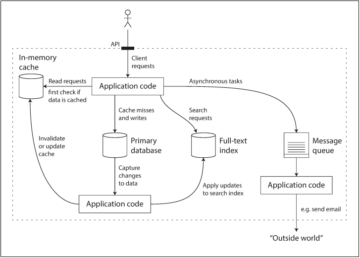
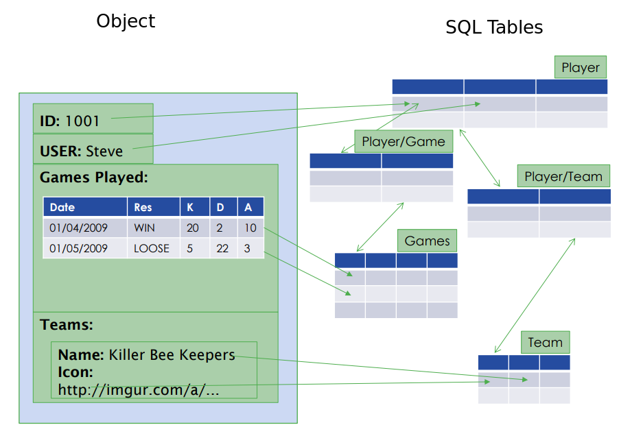
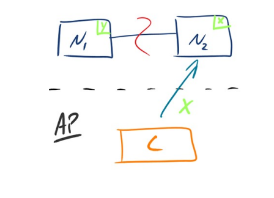
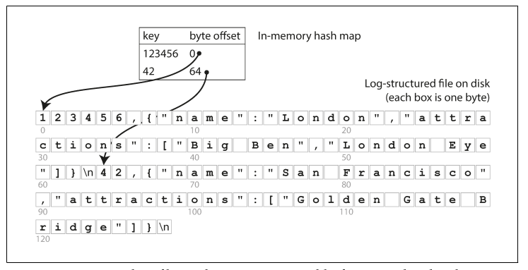
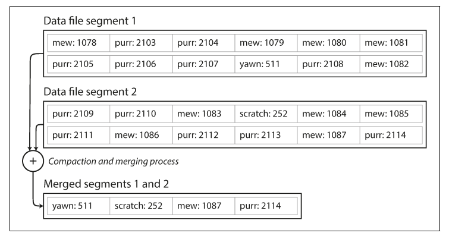
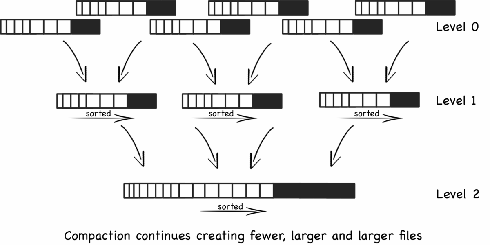
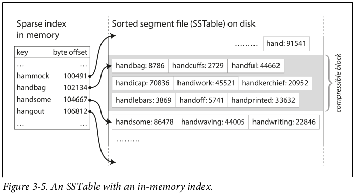

# Advanced Databases

Many Applications nowadays are more **data-intensive** than **compute-intensive**. This means that, for a lot of applications, CPU Power is not a lmiting factor. A lot of problems consist of:
* The ammount of data
* Complexity of data
* Speed of data changes

### Common operations in Data Systems
* (***DataBases***) Store data so that it can be found later
* (***Caching***) Remember the result of an expensive operation
* (***Search Index***) Allow users to search data by keywords or filters
* (***Message Queues***) Send message to another proccess to be handled asynchronously
* (***Stream Processing***) Observer what is happening and act on events as they occur
* (***Batch Processing***) Periodically crunch a large ammount of accumulated data

## Data Systems

More and more, applications have wide-ranging requirements. Many times these requirements are broken down into diferent tasks using different tools. They may need **caching**, a **text Search Server**(Solr), **main database**(MySQL), etc.

**Example of an architecture for a data System involving serveral components**
</img>
(image from Designing Data-Intensive Applications by Martin Kleppmann)

## Data Systems Challenges and Requirements

### Challenges
* How to ensure data remains correct and complete
* Provide constantly good performance
* How do you scale and handle bigger loads
* What is a good Api for a service

### Requirements
- **Reliability** -> should continue performing the correct function at the desired performance (even if there are issues)
- **Scalability** -> As the system grows, there should be ways to handle that growth
- **Maintainability** -> Many people, overtime, should be able to work with the System. (Maintaining the current behaviour and adopting the systems to new use cases)

---------------------------------------------

# Database Systems (brief introduction)
A **Database** is normally refered as a set of related data and it's organization

**DBMS(DataBase Managment System)** controls access to this data. Allows:
* writting 
* searching
* updating 
* retrieving 
* removing

From the **1980s until now today**, Relational Databases have been domination the market. They achived this because they are:
* Fast
* A normalized DB has no redundant data
* Developers are very familiar with Relational DBs
* The querie language for SQL is very well known and very good

In the **2000's** we have alse seen the start and growth of **OLAP(OnLine Analytical Processing)** and with this other models have been created

## Database Models

Database Models play a very important role in the development of software. They change:
* how software is written 
* how we think about the problems we are solving

A **Database Model** shows the logical structure of a database, including relanstioships and constrains that determine how data can be stored and accesses.

**Types of Database Models**:
* Hierarchical database model
* Relational model
* Network model
* Object-oriented database model
* Entity-relationship model
* Document model
* Entity-attribute-value model
* Star schema

-------------------

## ACID Properties in DBMS

A **Transaction** are single logical unit of work that access and possibly modifies contents in a Database.
Transactions access data using **read/write** operations. To maintain consistency in a Database we must follow certain properties. They are called **ACID**. 

### ACID
* **A** -> **Attomic** All changes to data are performed as if they are a single/atomic operation. This also means that if a transaction takes more than one operation to be completed, then all operations complete and commit or none do.  
* **C** -> **Consistency** A transaction transforms the database from one consistent state to anothe consistent state. Data is consistent when a transaction starts and when it ends
* **I** -> **Isolation** The intermideate state of transactions is invisible to other transactions. The results of a transaction are not visible until the transaction is completed
* **D** -> **Durable** The result of a failure transaction suvive failures. After a transaction is completed, even in the event of a crash or failure, transactions and changes won't be undone

----------------

## The Relational Model

Proposed in 1970, it has **dominated the market for more than 30 years**. It offers:

* **Persistance** -> We can store date and it will remain stored
* **Integration** -> Can be integrated into many different Apps
* **Standart** -> SQL, very well understood, very expressive, very good
* **Transactions** -> **ACID** properties

### Current Trends and the Problems and Issues of the Relational Model

* Increasing Volume of data and traffic
* More complex data connectedness
* The impedence mismatch problem

## Object-Relational Impedance Mismatch
Set of conceptual and technical difficulties that are often encoutered when a relational DBMS is being served by a Object-Oriented Program.

* The object oriented program uses object connections and orientation based on **Software engineering principles**
* Relational Paradigms are based on **Mathematics and Set Theory**

Mapping one to the other carries problems. Example of impendance Mismatch:

These problems are caused by normalization, but why do Relational DBs normalize?
* Constency both in style and spelling
* Avoiding ambiguity
* Easier to update (for example a team name)
* Avoids repeating data

The problems of impedance mismatch are not only that they add complexity to build software, they also make something more time consuming. We end up creating a representation of an object but when we want to store it we need to break it down into it's components and it needs to be encoded again. The problem also occurs when we want to the opposite operation.  

## Increased Data Volume

We are storing, creating and processing more data then ever before.
To deal with this increased storage needs we need to scale. Scalling can be done in two ways:
* horizontally -> more machines
* vertically -> bigger machines

SQL and DBMS suffer from the problem that it is almost impossible to scale horizontally. Most are designed to work on Single Large Machines

## Increased Data Connectivity

The data we are producing and exchanging is evolving and changing but not our DBMS

-----------------------

# The NOSQL Movement

The term NoSQL has changed over time from "no" to "not only". It does not refer to any technology in particular. It is usually used to refer to a group of different mostly non-relational technologies.

Key attributes of NoSQL:
* **Non Relational**
* **Simple API**: no Join
* **BASE and CAP**: no ACID requirements
* **Schema Free**: implicit schema on application side
* **Inherently Distributed**: some more than others
* **Open Source**: most of them at least

# BASE Transactions
* **BA** -> **Basic Availability** The database appears to work most of the time
* **S** -> **Soft State** Store don't have to be write-consistent nor do replicas have to be mutually consistent all the time. The BASE Model **does not enforce consistency**
* **E** -> **Eventual Consistency** The data model although does not enforce consistency it does not mean it won't be achieved. Until it does reach consistency reads are still possible. Stores wil exhibit consistency at some later point.

Characteristics:
* Optimistic
* Simpler and Faster
* Availability First
* Best Effort
* Approximation is OK

# CAP (Brewers's CAP theorem)

By Brewers's CAP theorem a distributed system can only support **2 of the following characteristics**

* **Cosistent** -> Writes are atomic, this means all subsquent requests receive the same value
* **Available** -> The database will always return a value so long as the server is running
* **Partition Tolerable** -> The system still fucntions even thought the cluster network is partitioned. This means, System will not fail even if there is a break between nodes

Assuming that we have a Distributed System it will most likely be **Partition Tolerable**. Therefore we have two options we can choose: **AP (Available and Partition Tolerable)** or **CP (Consistent and Partition Tolerable)**

|AP|CP|
|--|--|
|||
|Since Node1 and Node2 lost connections the system will return N2's most recent value and always be **available**. This value may be correct or wrong|Since Node1 and Node2 lost connections the system cannot ensure that it will return a consistent value, so it return an Error instead|

### Data Models in relation to CAP

# Types of NoSQL databases

* **Core Types**
    * Key-Value Stores
    * Document Stores
    * Column Stores
    * Graph Databases
* Non-Core Types
    * Object Databases
    * Native XML databases
    * RDF stores

### Data Connectivity of each DB Model

--------------------------------

# Storage and Retrieval

On the most fundamental level a database needs to do two things. **Store Data** and when you ask for data back, retrive it to you. All DBs do this but some are better at certain operations. Understanding these differences and Data Structures is important for selecting the best DB for your System.

The CSV is a good demonstration of their importance
- In a CSV the write/set function just appends to a file. This has very good performance, O(1) (many databases also use append-only data files for inserts)
- The read/get function however will take O(n) and this is not so ideal in a database with lots of records
(we can use an index to make reads faster but this will slow down the writes)

## Hash Indexes

Key-value stores are quite similar to the dictionary type that you can find in most
programming languages, and which is usually implemented as a hash map (hash
table). A simple key value Store were we append a file as the CSV example with a Key and a Value. This will have a O(n) lookup operation. Hash Indexes can greatly increase this time

**Strategy**
* A key value store works like a HashMap
* A simple storage that keeps and in-memory hashmap to where all the keys are mapped in the data file by their offset. (Bitcask for example uses this, It's good in situations where the value for each key changes a lot)

Storing a log of key-value pairs in a CSV-like format, indexed with an in-memory hash map

### Managing disk Space 

If we have a lot of key-value pairs in our Database our hashMap will grow huge and this will affect write performance and read performance and also storage may be an issue.

How do we avoid eventually running out of disk space. A good solution is to **break the log into Segments** of a certain size and make writes in a new file

* Creating Segments increases performance
* Each segments contains writes to the DB during some period of time
* We can then compact there files and throw away duplicate keys

Segment Compaction/Merging

### Issues with HashIndexes
* File Format -> text Formats are usually not very good, binary is good makes it unreadable for DB managers
* Deleting Records -> We need to be careful when deleting records because of the merging and compaction proccess
* Crash Recovery -> if the system is restarted the in memory hashMaps are lost
* Partially written record -> The DB may crash and some records maybe only be half written
* Concurrency Control -> Writes are in sequencial order

### Append Only Logs design
Advantages
* Read Times are good with hashIndexes
* Appending and segment merging in faster that random writes
* Crash recovery is easier if segment files are write only

Disavantages
* Must fit HashTables is memory
* Range Queries have very bad complexities
* Deletion is also very hard to be achieved

## SSTables based and LSM-Trees

SST(Sorted String Tables) are **based on HashIndexes** but in this case the we can ensure that key value-pairs are unique and we can sort them by key

We need to then ensure that a key only appears once in a compacted segment. To achieve this we use **LSM (Log-Structured Merges)** and produce a Tree out of the different segments. This will only keep the most recent value for each key

Now all that we need to do is create and update our SST in correspondance with our merged Log.

No need to keep all the key value Pairs in memory because we can use a **Sparse Index** and still keep reads very fast, and save memory

The advantages over HashIndexes are
* Merging is simpler and more efficient, even when files are bigger than available memory
* no nee to keep an index of all the keys in memory

* Writes and still very fast, because it is still append only
* lower disk footprint

Disavantages
* A bit Slower reads but still very good read times
* merging need to be done in a background proccess

## B-Trees (Balanced Trees)

Like SSTables, B-trees keep key value pairs sorted by key, but instead of a table it uses Balanced-Trees. Mostly used in Relatonal Databases.

B-Trees break down the database into fixed sized blocks or pages and read or write one page/block at the time

- The Tree always remains balanced. Usually it's an AVL or a red-black Tree
- Search O(log(n))
- Insert O(log(n))
- Delete O(log(n))

| Advantages  | Disavantages |
| :---        |    :----:   |
| Reads are O(log n) very fast    | Keeping the tree balanced takes processing resources       |
| 256 TB in 4 level deep tree, very fast for reads   | Inserting and deleting can become slow operations        |
Another Great advantage of Balanced Trees in the ease and effectivness of Indexes | Indexes will slow down write and delete times|
Range Queries are very efficient and fast with proper indexing

### WAL (Write Ahead Log)
- Since B-Trees write/ovewrite data on their inserts, because of this if there is a crash it is harder to recover and we end up with a corrupted page or set of pages. To deal with this we can use a **Write Ahead Log (WAL)**
- Consists of an Append only file that stores every modification applied to the database

### Problems

Another problem with B-Trees is the fact that multiple threads or proccesses are very problematic and almost impossible to implement. B-Trees need concurrency control. This way it is almost impossible to distribute a B-Tree and that is why Relational Databases are not distributed

### Optimizations
* Copy on write Scheme
* Can save space by not storing the entire key and reducing the number of levels
* Fractal Trees 

